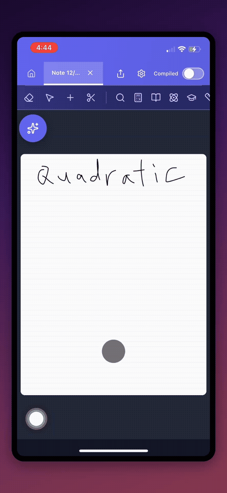

# Touchful

Transform screen recordings into polished videos with tap animations and device frames. Perfect for app demos, tutorials, and social media content.

<p align="center">
  
</p>

## Features

- **Automatic tap detection** - Uses computer vision (OpenCV.js) to detect tap/click interactions in screen recordings
- **Tap animations** - Add visual feedback (ripple, pulse, glow, ring, dot) to highlight user interactions
- **Device frames** - Wrap your video in realistic device bezels with gradient backgrounds
- **Smart camera** - Auto-zoom and follow taps for a cinematic feel
- **Fast export** - Hardware-accelerated encoding via WebCodecs API
- **100% browser-based** - All processing happens locally, no uploads required

## Tech Stack

- React + Vite
- TailwindCSS
- OpenCV.js (tap detection)
- WebCodecs API (fast video encoding)
- mp4-muxer / webm-muxer (video container creation)

## Getting Started

```bash
# Install dependencies
npm install

# Start dev server
npm run dev

# Build for production
npm run build
```

## How It Works

1. **Upload** a screen recording
2. **Detect taps** automatically or add them manually
3. **Customize** the look - choose device frame, background, animation style
4. **Export** as MP4 or WebM

The app analyzes video frames to find grey circular tap indicators (like iOS/Android accessibility features), then renders each frame with your customizations applied.

## Browser Support

Requires a modern browser with WebCodecs support (Chrome 94+, Edge 94+). Falls back to slower encoding on unsupported browsers.

## License

MIT
